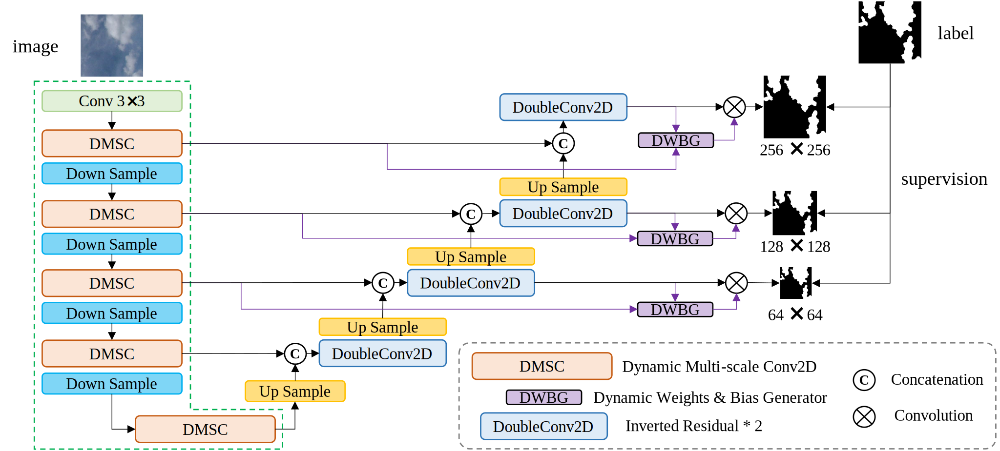
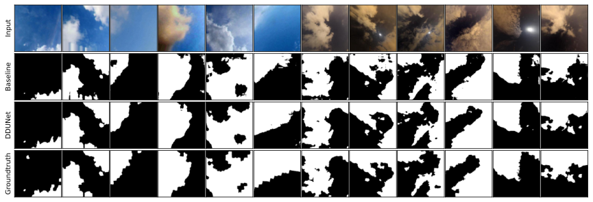

# DDUNet: Dual Dynamic U-Net for Highly-Efficient Cloud Segmentation

## 1. Abstract

Cloud segmentation amounts to separating cloud pixels from non-cloud pixels in an image. Current deep learning methods for cloud segmentation suffer from three issues. (a) Constrain on their receptive field due to the fixed size of the convolution kernel. (b) Lack of robustness towards different scenarios. (c) Requirement of a large number of parameters and limitations for real-time implementation. To address these issues, we propose a Dual Dynamic U-Net (DDUNet) for supervised cloud segmentation. The DDUNet adheres to a U-Net architecture and integrates two crucial modules: the dynamic multi-scale convolution (DMSC), improving merging features under different reception fields, and the dynamic weights and bias generator (DWBG) in classification layers to enhance generalization ability. More importantly, owing to the use of depth-wise convolution, the DDUNet is a lightweight network that can achieve 95.3\% accuracy on the SWINySEG dataset with only 0.33M parameters, and achieve superior performance over three different configurations of the SWINySEg dataset in both accuracy and efficiency. 



## 2. Dedpendencies

### 2.1 PaddlePaddle

For CUDA 12

```
python -m pip install paddlepaddle-gpu==2.6.2.post120 -i https://www.paddlepaddle.org.cn/packages/stable/cu120/
```

### 2.2 Others

```
pip install numpy pillow pandas matplotlib scikit-learn 
```

### 2.3 Dataset

Please download the `SWINySEG` dataset from [link](https://vintage.winklerbros.net/swinyseg.html), and place the dataset in `./dataset` following the structure:

```
.
├── README.md
└── SWINySEG
    ├── GTmaps
    ├── images
    ├── metadata.csv
    ├── README.pdf

```

and then place the `txt` files in `./dataset/SWINySEG-split` to `./dataset/SWINySEG`

## 3. Usage

### 3.1 Train

`train.py` usage
```
usage: train.py [-h] [--config CONFIG] [--base_channels BASE_CHANNELS] [--batch_size BATCH_SIZE] [--lr LR] [--epochs EPOCHS] [-iou] [--dataset_split DATASET_SPLIT]
                [--dataset_path DATASET_PATH] [--eval_interval EVAL_INTERVAL]

options:
  -h, --help            show this help message and exit
  --config CONFIG       the config of model (default: full)
  --base_channels BASE_CHANNELS
                        the base_channels value of model (default: 8)
  --batch_size BATCH_SIZE
                        batchsize for model training (default: 16)
  --lr LR               the learning rate for training (default: 5e-4)
  --epochs EPOCHS       number of training epochs (default: 100)
  -iou                  use iou loss (default: False)
  --dataset_split DATASET_SPLIT
                        split of SWINySEG dataset, ['all', 'd', 'n'] (default: all)
  --dataset_path DATASET_PATH
                        path of training dataset (default: ./dataset/SWINySEG)
  --eval_interval EVAL_INTERVAL
                        interval of model evaluation during training (default: 5)
```

**Full Model**

```
python train.py
```

**Baseline+DMSC**

```
python train.py --config 'dmsc'
```

**Baseline**

```
python train.py --config 'baseline'
```

### 3.2 Test

```
python test.py
```

## 4. Results

